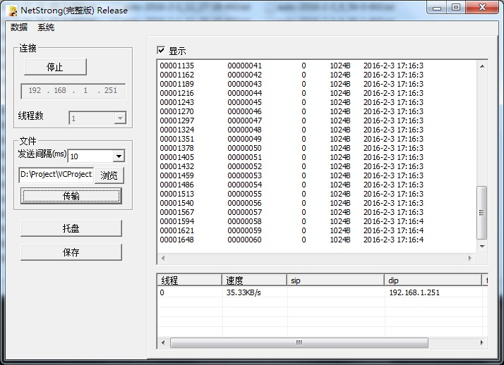

<div >
<ul>
<li><a href="#netstrong">NetStrong</a></li>
<li><a href="#_1">服务器性能</a></li>
<li><a href="#_2">网络拓扑</a></li>
<li><a href="#_3">测试数据包</a></li>
<li><a href="#_4">通信协议</a><ul>
<li><a href="#_5">原协议</a></li>
<li><a href="#netstrong_1">NetStrong协议</a></li>
<li><a href="#_6">日志保存格式</a><ul>
<li><a href="#_7">日志描述内容</a></li>
<li><a href="#_8">服务器返回信息</a></li>
</ul>
</li>
</ul>
</li>
</ul>
</div>


# NetStrong

网络强壮性测试客户端。  
属于 **分布式网络测试** 方法，每个客户端只需要与服务器保持2-10KB/S即可。用于测试公司内部某TCP服务器平台是否存在漏包、掉线、吞吐率、服务器CPU利用率。  
NetStrong定时将日志以 EMail 方式发送给开发者，邮件密码已用base64编码加密





# 服务器性能
- 运行于Linux系统，采用epoll机制
- 服务器环回地址或自身IP连接速度能达到 **15MB/S**
- 与其他外部设备通信速率仅 **600-700KB/S** ，此参数受网络数据包流向的瓶颈设备影响
- 服务器能至少连接800个客户端


# 网络拓扑
- 服务器与多台有 **业务的客户端** 连接，并保持业务
- 多台运行NetStrong客户端与服务器连接，并定时发送“测试数据包”数据包，


#测试数据包
- 可以看成是心跳数据包，数据包大小可变，可模拟不同数据量下服务器的处理性能
- 每个数据包有个ID号以及其他信息附属信息，最后是垃圾数据用于占用网络带宽，数据大小数百Byte～100KB
- 当服务器收到测试数据包后 **解析** 数据包头内容，并以ASCII码发送回客户端
- 客户端记录收到的信息作为日志，日志保存并发送到指定 **邮箱**


# 通信协议
协议分为3层：

* 第1层是原工程所用的协议GLink帧格式，属于TCP协议的数据域
* 第2层是TMSxxTC协议，TMXxxTC遵循Glink帧格式
* 第3层NetStrong是原TMSxxTC协议基础上做的扩展，占用协议里的某几个CMD ID


##原协议
协议所有内容以 **大端** 方式发送，原始协议最小帧长40Byte  

- **起始帧标志** ：4Byte，固定填充0xffffeeee
- **帧总长度** ：4Byte，表示整个数据包长度（4×10 + n Byte）
- **保留** ：4Byte + 4Byte + 4Byte + 4Byte + 4Byte，无用
- **命令码** ：4Byte，为了不予原协议冲突，NetStrong采用0x20000000 ～ 0x20000010范围
- **数据长度** ：4Byte，命令码（4Byte） + 数据长度（4Byte） + 数据包内容 （8 + n Byte）
- **数据内容**： nByte，格式根据 **命令码** 而定
- **结束帧标志** ：4Byte，固定填充0xeeeeffff


##NetStrong协议
- **原协议** 的命令吗填写0x20000002
- **数据内容**
	- **数据包ID**： 4Byte，NetStrong客户端每次发送数据包，该字段递增
	- **线程ID**： 4Byte，NetStrong客户端如果有多个客户端连接服务器，客户端给自己的线程ID编号，每个线程ID独一无二
	- **发送时间**： 16Byte，NetStrong客户端写入每次封包的时间，格式以 "yyyy-mm-dd HH-MM-SS"

**在本工程里提供了已经封装好的数据包，目录位置./netpacket/*.bin，如1k.bin表示发送1024Byte的测试数据包，其中包含原始数据包，所以数据长度应该是1024+40Byte**


##日志保存格式
分为2部分，
- 第1部分是日志描述内容
- 第2部分是NetStrong收到服务器的反馈内容


### 日志描述内容
```
File Title
host name: WIN-GRJQUJT8QE0				你的计算机机名
ip 0 :192.168.1.230						计算机所有的IP地址
ip 1 :192.168.56.101
coonnect time 2016-01-31 21:40:15		点击启动按钮的时间
send time     2016-01-31 21:40:16		点击发送按钮的时间
save time     2016-01-31 21:43:19		自动保存时间
------------------------------------------------------	
```


###服务器返回信息
每一行都是服务器解析 **NetStrong协议** 后的适当反馈
```
00000054	00000000	   0	2048B	2016-2-1 9:4:44
00000107	00000001	   0	2048B	2016-2-1 9:4:45
00000160	00000002	   0	2048B	2016-2-1 9:4:47
00000213	00000003	   0	2048B	2016-2-1 9:4:48
```
**00000054**   
服务器处理序列号，连续发送相同大小的数据包，两两序列号"差值"应该相同（差值107-54=53），即使不同，序列号值不不得超过公共序列号2倍，否则可鉴别服务器掉包

**00000001**   
客户端发送数据的ID，此ID应该连续，否则可鉴别服务器掉包

**0**          
服务器发送线程ID

**2048B**    
服务器接收数据包大小

**2016-1-27 9:23:2**  
客户端发送数据的时间，鉴别客户端每秒发送多少次数据包


